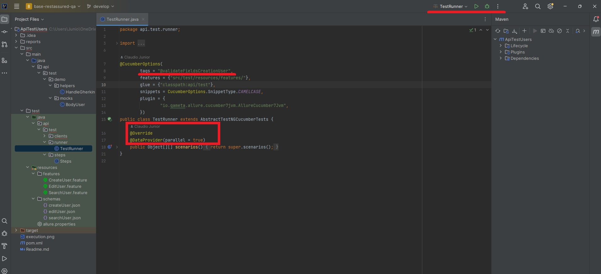

<p align="center">
  
  <h1 align="center">Projeto de Testes de API com Rest Assured</h1>
</p> 

<p align="center">
  <a href="#-objetivo">Objetivo</a>&nbsp;&nbsp;&nbsp;|&nbsp;&nbsp;&nbsp;
  <a href="#-estrutura">Estrutura</a>&nbsp;&nbsp;&nbsp;|&nbsp;&nbsp;&nbsp;
  <a href="#-execução">Execução</a>
</p> 

<p align="center">
  
  
  
  
  
  
</p>

## 🎯 Objetivo
O projeto de automação tem como objetivo ajudar a executar muitos casos de testes de forma consistente e repetidamente em diferentes ambientes, permitindo um melhor escalonamento dos casos de testes. Também é um objetivo a melhoria da qualidade do software com um todo, pois testes automatizados proveem uma melhor cobertura quando se tratam de testes que buscam validar se defeitos antigos e que já foram resolvidos não ressurgiram (testes de regressão).

## 🌌 Estrutura

Para organização do sistema o mesmo foi separado em diversas pastas para que ficassem distribuidas de acordo com suas
funções.

- ### **base-restassured-qa**
    - ***Clients***
        - Contém os arquivos Java que possuem métodos de validação, manipulação, requisições e tratamento de dados

    - ***Mocks***
        - Contém arquivos Java que possuem os payloads para realização de requisições.

    - ***Schemas***
        - Contém arquivos Json que possuem um contrato para validação dos responses das nossas requests

    - ***Features***
        - Contém os arquivos ".feature" onde são expecificados os cenários de testes em linguagem Gerkin.

    - ***Step***
        - Contém os arquivos Java onde são expecificados os steps dos nossos cenários de teste.

    - ***Helpers***
        - Contém os arquivos Java onde são expecificados métodos que nos auxiliam na realização dos testes.
     
    - ***Runner***
        - Contém a classe com as configurações para execução do projeto.
          
    - ***Reports***
        - Contém os arquivos de report gerados após a execução do projeto.

           
## ⏩ Execução
   - ### **1º Passo**
        - ***Instale asdependências do projeto***
          - ```Java JDK 20```
          - ```IntelliJ```
          
  - ### **2º Passo**
    - ***Execute um script básico***
      - ```Acesse a classe Runner e realize a execução pela propria IDE```



- #### **Obs: O projeto possui paralelismo e execução por tags configurado**
